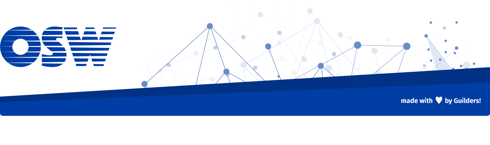
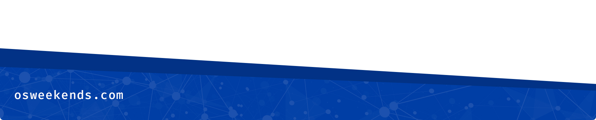

# Read for kids

> La aplicación con la que aprenderán a leer tus hijos.

**Motivación**

Queremos que cualquier niño pueda tener acceso al aprendizaje de la lectura con el apoyo de herramientas tecnológicas.

Con ese punto de partida queremos construir una aplicación multiplataforma con la que un niño pueda aprender a leer, o al menos sirva de apoyo al aprendizaje, de una forma divertida y con la mayor autonomía posible.

### Equipo

 - [ Joaquín Fernández (@jfpernas)](https://github.com/jfpernas) (Leader)
 - [ Borja Godoy (@borjagodoy)](https://github.com/borjagodoy) (Contributor)
 - [ Jorge Baumann (@baumannzone)](https://github.com/baumannzone) (Contributor)
 - [ Laura Jordán (@laujorpan)](https://github.com/laujorpan) (Contributor)
##### Agradecimientos

##### Necesitamos

Diseñadores, Frontends y Backends, logopedas, profesores, y por supuesto cualquiera con ganas de aportar ideas.

### Demo

_No tenemos demo disponible por el momento_

### Tecnología utilizada

- ionic
- pillars
- mongo

#### Dependencias
- **Plataforma de Github**: Para facilitar el clonado
- **Markdown**: Para mejorar la sintaxis y la semantica

### Cómo contribuir en el proyecto

**Más informacion en [CONTRIBUTING.md](CONTRIBUTING.md)**

### Estado del proyecto.

_Desarrollo activo._

### Releases anteriores

_Primera release en desarrollo activo_

### Licencia

GNU General Public License v3.0

